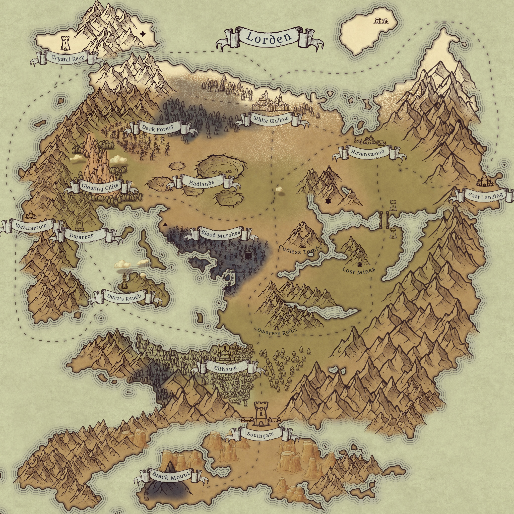
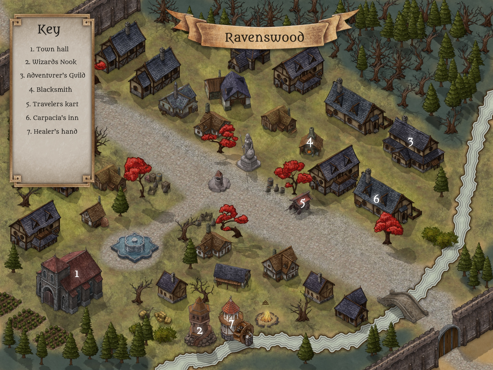
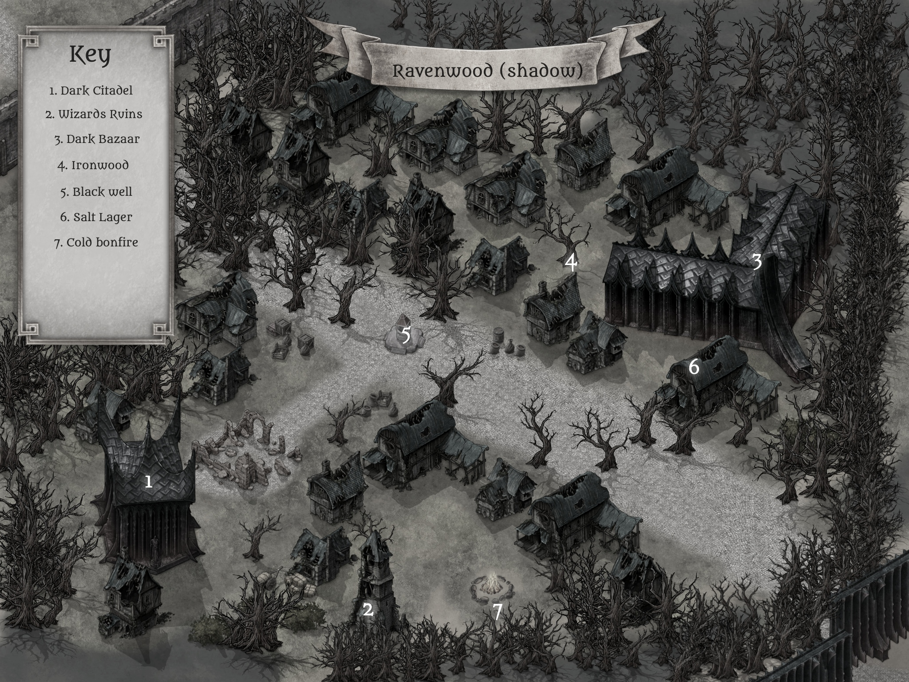
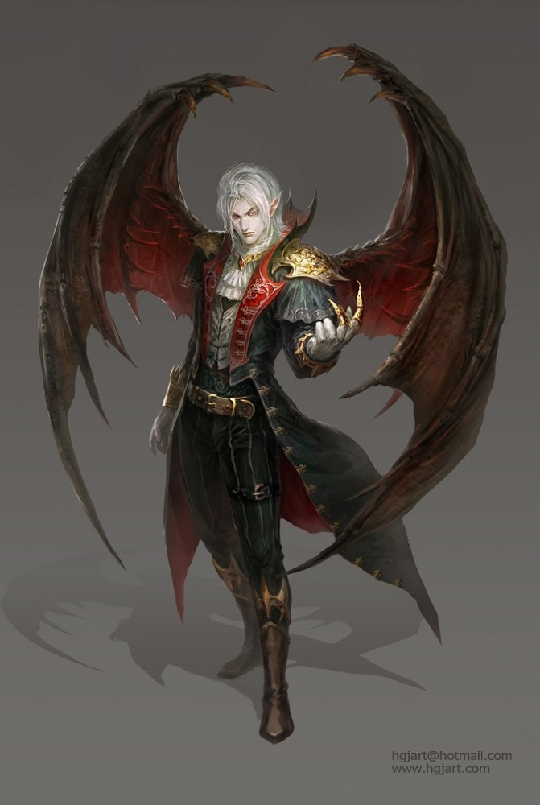
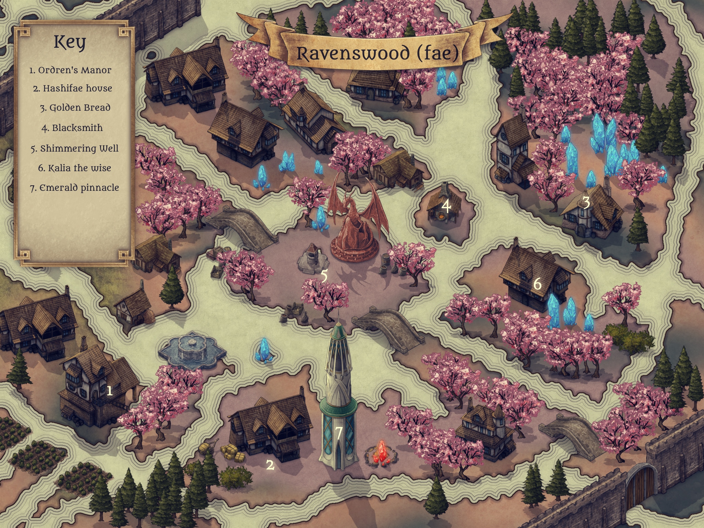
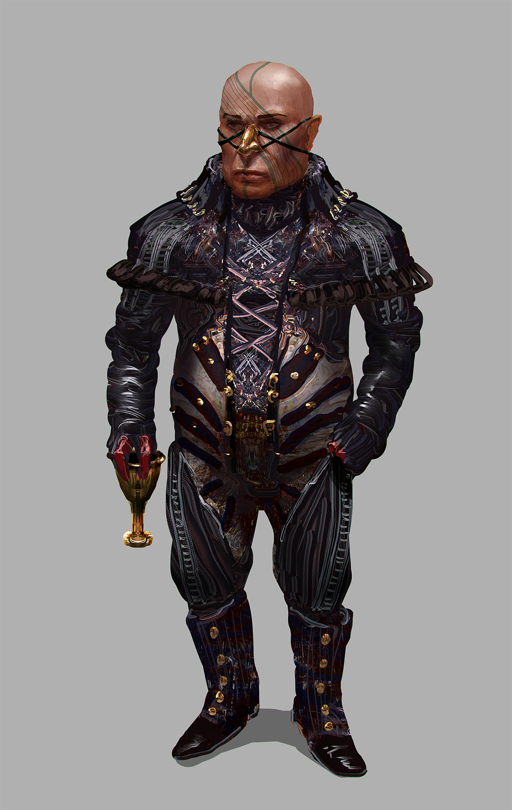

# The Maw

A mysterious mark, a mysterious prophecy, what could it mean...

## Character sheets

<a href="https://www.dndbeyond.com/characters/26402383/BaWdPQ" >Damreus (Alex)</a>

<a href="https://www.dndbeyond.com/characters/26696317/8iaO2z" >Bel (Mollie)</a>

<a href="https://www.dndbeyond.com/characters/26355472/b9DM9b" >Nebbles (Neal)</a>

<a href="https://www.dndbeyond.com/characters/26596309" >Somerled (Kacper)</a>

## Lorden

The travelers began their journey in ravenswood of lorden, at the wizards nook.

## Session 1

The party was decieved by Draco (or supposedly him) who gave them a magical tattoo on their right wrist.

the mark:

Draco turned into shadow and the party was sent to the shadow dimension (shadowfell)...
Ravenswood had been transormed and turned into a shadow version of itself...

The party was then attacked by the undead (skeleton warriors)
#### Notable encounter: a spirit dog 

The party narrowly escaped the shadow creatures and made it to the dark citadel

#### Somerled (kacper) +1 silver sword

Party met Saffos:

Saffos explained to them that they are part of a prophecy, 
they are bound to the three realms and travel between them sporadically
Saffos provided a ring for Ondren of the fey, 

#### Nebbles (Neal) could tell there is something about this ring that was evil
Neal took it and put it in a bag. 

Feeling a burning sensation the group was then sent to the fey world...
Ravenswood was turned into a fey version of itself

They went to the fae world, 
Neal warned about the ring probably being cursed,
Neal gave the ring to Ondren,
Ondren put the ring in a drawer for further study

#### Somerled (Kacper) +1 magical bowstring
#### Damreus (Alex) got a bottle of the shimmering fey well water
#### Nebbles (Neal) smoked hashifae & got a whimsical potion of booming voice (allows the user to speak fey, but also makes their voice incredibly loud, whispering is like screaming for 12 hours)
#### Bel (Mollie) has 2 elvish waybread - these can act as replenishment like a short rest

The next goal is to get a syncronator (maybe have to work for it since it's a pricey piece of equipment which can channel planar energies) that will be what ludmarillion sets them to do. Ludmarillion knows the way into wizard city (the password), but won't tell it unless they help him.

### Gold
Mollie 23

Somerled (Kacper) 20

Neal 80

Alex 70

### Loot
Bel (Mollie) +2 elven bread

Somerled (kacper) +1 silver shortsword, +1 magic bowstring, 

Nebbles (Neal) hashifey, 

Damreus (Alex) +1 sparkle potion

## Session 2

#### pre-game, everyone +1 level (2nd level)

#### Dark lisa + Bel are now friends
Bel had a successful charisma roll, dark lisa recommends bel find "witches shadow" in the shadow dimension
to expand her necromancy and level them both up.  

### ludmarillion 

Somerled (kacper) intimidated ludmarillion
Bel (mollie) persuaded ludmarillion successfully
Damreus (alex) attempted 3 seductions and did not succeed 

Ludmarillion will give access to a wizard who can make a synchronator, 
but wants something in return...

### Ludmarillions quests:
1. A shipment of precious magical components was lost on the coast, it seems to be infested with evil merfolk type creatures. Collect as many of the components / materials as you can and he will reward you appropriately

2. There's a local wizard who seems to be turning people to sheep, horses and other animals it's getting a bit bothersome and affecting his bottom line. Get to the bottom of this and if possible get his wand for Ludmarillion to inspect.

3. If you're in the fey wilds, there's a satyr who lives about 1/2 a mile north of ravenswood, he'll have some yew wands, they make excellent bases for wands.

### Adventurer's guild
Rates:
anti-venom (2gp), 
holy water (2gp), 
firewood (1gp), 
rations (1gp), 
rope (1gp),
shovels (1gp)
skeleton keys (1gp)

### Bill (Ravenswood blacksmith)
dingy blacksmith, somewhat dull and thick headed but friendly individual... doesn't seem to know all too much.
small leather armor (1gp)
short sword (1gp)
scythe (1gp)
quiver of arrows (1gp)

### Travelers Kart
Scimitar of Speed (very rare, gp 199)
Spell Scroll (Protection from Evil and Good) (common, gp 200)
Spell Scroll (Ray of Frost) (common, gp 200)
Portable Hole (rare, gp 185)
Potion of Healing (common, gp 18)
Spell Scroll (Holy Aura) (very rare, gp 200)
Potion of Water Breathing (uncommon, gp 188)
Wand of Pyrotechnics (common, gp 140)
+1 Armor (ring mail) (rare, gp 152)
Spell Scroll (Silent Image) (common, gp 100)

### Provisions
Bel (+2 holy water, +1 anti venom)

Nebbles (neal) +5 holy water

Damreus (alex) +5 antivenoms, +1 potion of healing

### 1. The shipment
The adventurers set out into the shipwreck to find it infested with troglodytes.
After defeating the troglodytes the adventurers found 3.5 barrels of magical powders and brought them back to ravenswood

#### "You know what time it is" - somerled
#### maru helped the team find a secret room
#### Bel (mollie) skimmed a bit off the top into a couple sacks

### Gold
Bel (Mollie) 14gp 

Somerled (Kacper) 20 

Neal 70

Alex 43

### Loot
Bel (Mollie) 
+1 human skull, 
+1 bat skull, 
+1 troglodyte tome, 
+1 sacrificial knife 
+1 bag of magic black powder (spider webs) 
+1 bag of magic white powder
+1 bag of magic yellow powder
+1 bag of magic feathers 

Somerled (kacper) -1 silver sword (broken), -1 bowstring (maru)

Nebbles (Neal) +1 ships log, +1 wind crystal

Damreus (Alex) +1 eldritch tome

